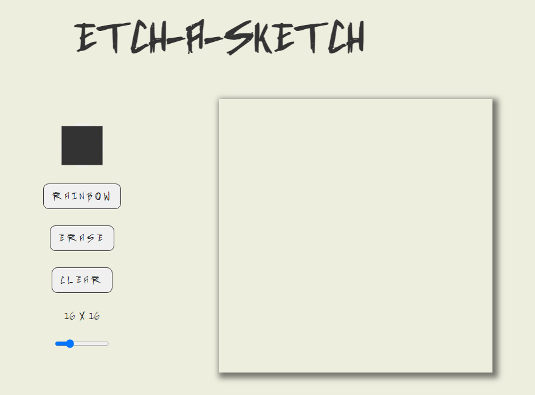

# Odin Project - Etch-a-sketch

Simple Etch-a-sketch in Vanilla JS from the Odin Project curriculum.

## Table of contents

- [Overview](#overview)
  - [Screenshot](#screenshot)
  - [Links](#links)
- [My process](#my-process)

  - [What I learned](#what-i-learned)

  ## Overview

  ### Screenshot

  

  ### Links

  - Live Site URL: [Live Site](https://splendid-lollipop-9e6382.netlify.app/)

  ## My Process

  - Semantic HTML5 markup
  - CSS custom properties
  - Flexbox
  - Grid
  - Vanilla JS

  ### What I learned

  How to make a grid using JS

  ```js
  function setupGrid(size) {
  	gridContainer.style.gridTemplateColumns = `repeat(${size}, 1fr)`;
  	gridContainer.style.gridTemplateRows = `repeat(${size}, 1fr)`;

  	for (let i = 0; i < size * size; i++) {
  		const squareGrid = document.createElement('div');
  		squareGrid.className = 'grid-square';
  		gridContainer.appendChild(squareGrid);
  	}
  }
  setupGrid(16);
  ```

  How to create a rainbow random color hover

  ```js
  function setRainbowColorHover() {
  	const rainbowBtn = document.querySelector('#btnRainbow');

  	rainbowBtn.addEventListener('click', () => {
  		gridContainer.removeEventListener('mouseover', setBlackColorHover);

  		gridContainer.addEventListener('mouseover', function (event) {
  			if (event.target.classList.contains('grid-square')) {
  				const randomR = Math.floor(Math.random() * 256);
  				const randomG = Math.floor(Math.random() * 256);
  				const randomB = Math.floor(Math.random() * 256);
  				const randomColor = `rgb(${randomR},${randomG},${randomB})`;
  				event.target.style.backgroundColor = randomColor;
  			}
  		});
  	});
  }
  ```
